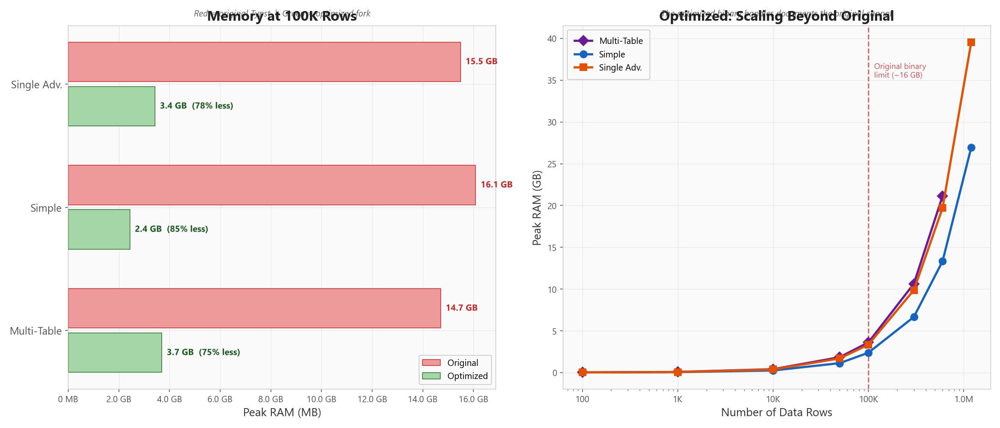
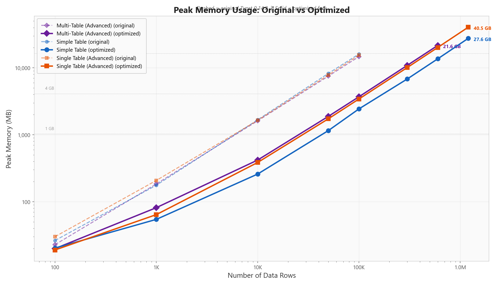
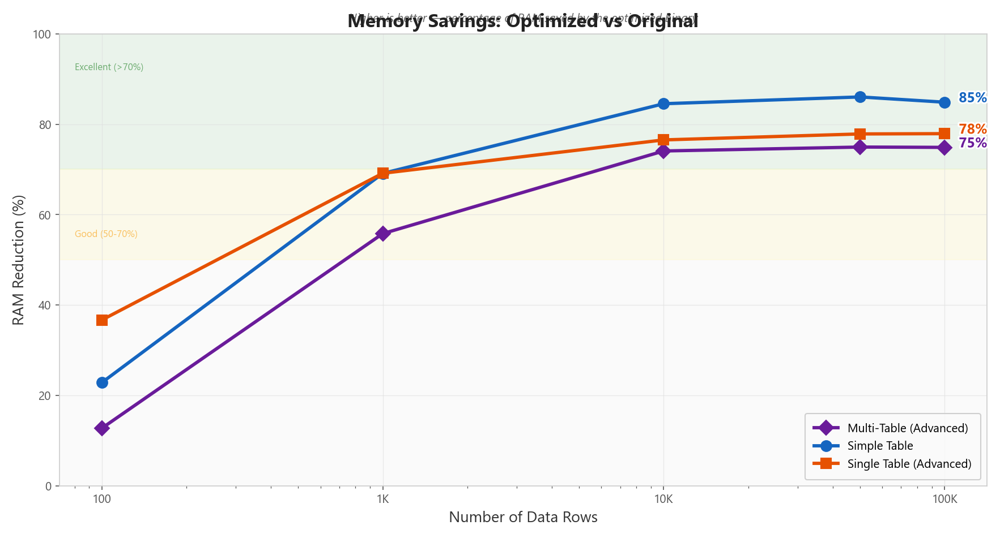
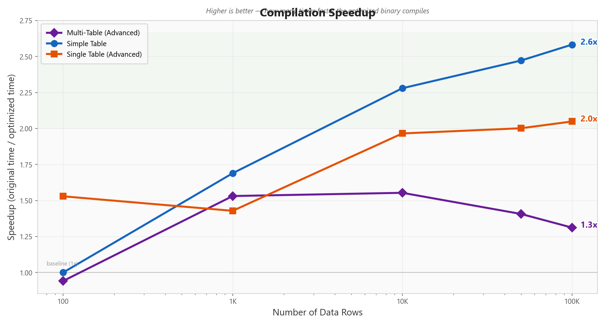
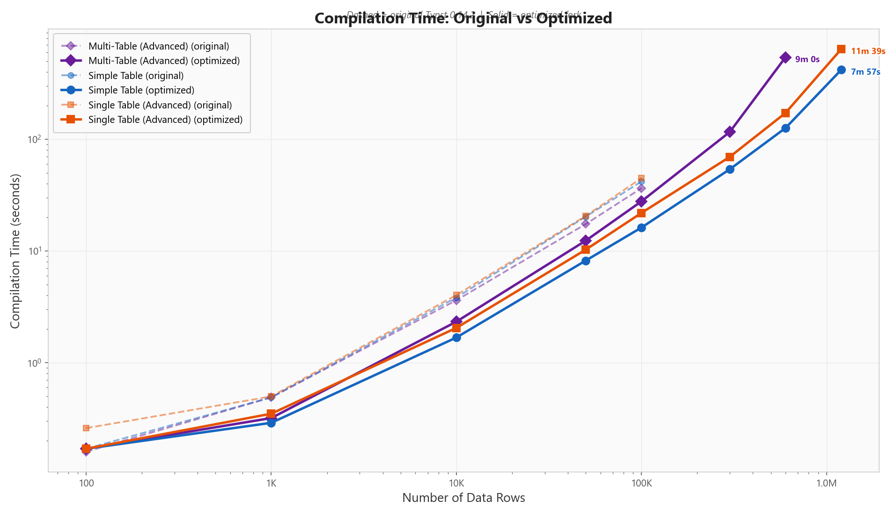
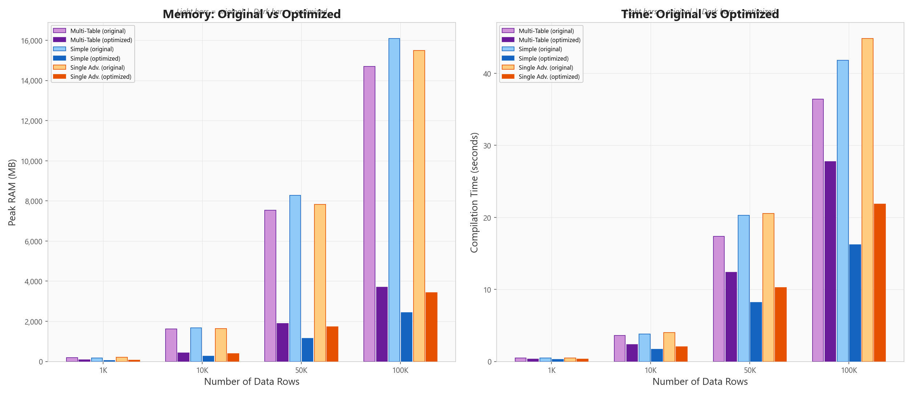
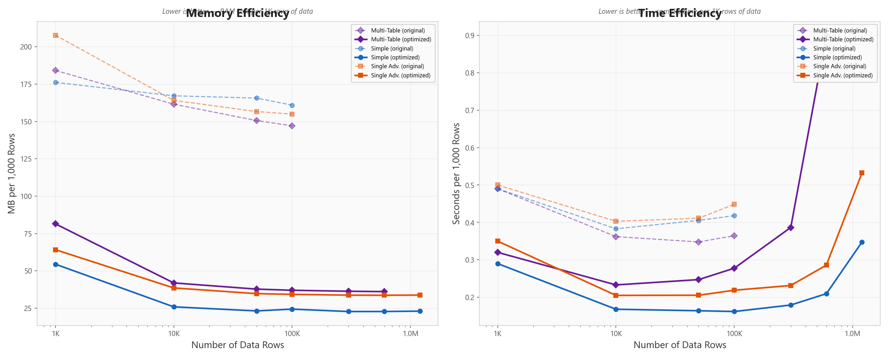
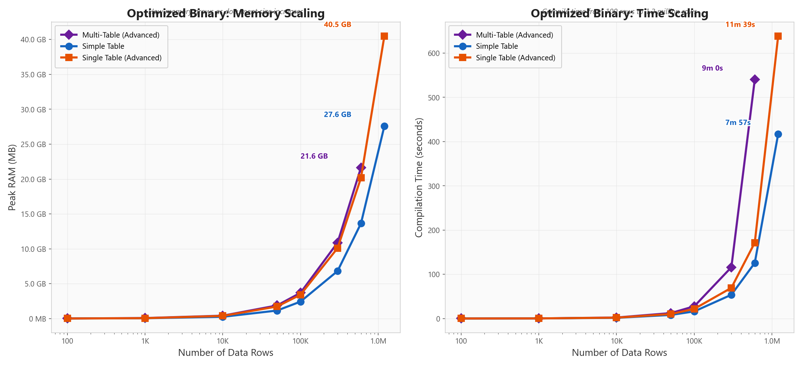

# Typst Memory Optimization Benchmarks

Comprehensive benchmarks comparing the **original Typst 0.14.2** binary against the **optimized fork** with memory reduction patches. All measurements are real profiling data collected on the same machine under consistent conditions.

## Key Results

At **100,000 rows** (the largest size both binaries can handle):

| Metric | Original | Optimized | Improvement |
|--------|----------|-----------|-------------|
| **Simple Table** — Peak RAM | 16,087 MB | 2,435 MB | **85% reduction** |
| **Simple Table** — Time | 41.8s | 16.2s | **2.6x faster** |
| **Single Table (Advanced)** — Peak RAM | 15,491 MB | 3,423 MB | **78% reduction** |
| **Single Table (Advanced)** — Time | 44.8s | 21.9s | **2.0x faster** |
| **Multi-Table (Advanced)** — Peak RAM | 14,706 MB | 3,696 MB | **75% reduction** |
| **Multi-Table (Advanced)** — Time | 36.4s | 27.8s | **1.3x faster** |

The optimized binary scales to **1.2 million rows** (producing 3+ GB PDFs) — sizes the original binary cannot handle at all.

## Overview

<p align="center">
  
</p>

## Graphs

### Peak Memory Usage

Log-log comparison showing peak RSS across all row counts. Dashed lines = original, solid = optimized. The gap between the curves represents the memory savings — consistently 75-85% at scale.



### Memory Reduction Percentage

How much RAM the optimized binary saves at each data size. Reductions grow with scale, reaching **75-85%** at 100K rows.



### Compilation Speed

The optimized binary is consistently faster, with speedup increasing at larger sizes. Simple tables see the biggest benefit (**2.6x** at 100K rows).



### Time Comparison

Log-log plot of wall-clock compilation time for all templates and sizes.



### Side-by-Side Comparison

Direct comparison at key data sizes. Faded bars = original, solid = optimized.



### Scaling Efficiency

RAM and time per 1,000 rows. The optimized binary uses **~23 MB/1K rows** vs the original's **~160 MB/1K rows** — a 7x efficiency improvement.



### Optimized Binary: Large Document Scaling

The optimized binary handles documents the original cannot. At 1.2M rows it produces a 3+ GB PDF while staying within ~28-40 GB RAM.



## Full Results Table

### Original vs Optimized (100 to 100K rows)

| Template | Rows | Orig RAM (MB) | Opt RAM (MB) | RAM Saved | Orig Time | Opt Time | Speedup |
|----------|------|---------------|--------------|-----------|-----------|----------|---------|
| Simple | 100 | 26 | 20 | 23% | 0.17s | 0.17s | 1.0x |
| Simple | 1,000 | 176 | 54 | 69% | 0.49s | 0.29s | 1.7x |
| Simple | 10,000 | 1,671 | 259 | 85% | 3.83s | 1.68s | 2.3x |
| Simple | 50,000 | 8,281 | 1,157 | 86% | 20.27s | 8.20s | 2.5x |
| Simple | 100,000 | 16,087 | 2,435 | 85% | 41.81s | 16.19s | 2.6x |
| Single Adv. | 100 | 30 | 19 | 37% | 0.26s | 0.17s | 1.5x |
| Single Adv. | 1,000 | 208 | 64 | 69% | 0.50s | 0.35s | 1.4x |
| Single Adv. | 10,000 | 1,641 | 385 | 77% | 4.03s | 2.05s | 2.0x |
| Single Adv. | 50,000 | 7,830 | 1,735 | 78% | 20.56s | 10.27s | 2.0x |
| Single Adv. | 100,000 | 15,491 | 3,423 | 78% | 44.83s | 21.88s | 2.0x |
| Multi-Table | 100 | 23 | 20 | 13% | 0.16s | 0.17s | 0.9x |
| Multi-Table | 1,000 | 184 | 81 | 56% | 0.49s | 0.32s | 1.5x |
| Multi-Table | 10,000 | 1,615 | 419 | 74% | 3.62s | 2.33s | 1.6x |
| Multi-Table | 50,000 | 7,528 | 1,887 | 75% | 17.39s | 12.36s | 1.4x |
| Multi-Table | 100,000 | 14,706 | 3,696 | 75% | 36.44s | 27.77s | 1.3x |

### Optimized-Only (beyond original's limits)

| Template | Rows | Peak RAM (MB) | Time | PDF Size |
|----------|------|---------------|------|----------|
| Simple | 300,000 | 6,819 | 53.8s | 749 MB |
| Simple | 600,000 | 13,645 | 125.8s | 1,502 MB |
| Simple | 1,200,000 | 27,601 | 417.1s | 3,087 MB |
| Single Adv. | 300,000 | 10,105 | 69.4s | 923 MB |
| Single Adv. | 600,000 | 20,167 | 171.6s | 1,849 MB |
| Single Adv. | 1,200,000 | 40,502 | 638.7s | 3,741 MB |
| Multi-Table | 300,000 | 10,889 | 116.0s | 917 MB |
| Multi-Table | 600,000 | 21,636 | 540.1s | 1,838 MB |

> **Note:** Multi-Table at 1.2M rows (25,341 separate tables) was excluded — it requires ~40+ GB RAM and gets stuck during PDF serialization. This is a known limitation of the multi-table architecture where each group creates a separate table element.

## Test Templates

Three templates test different real-world table patterns:

### 1. Simple Table (`table_test.typ`)
- Plain 10-column table with no styling
- Single continuous `#table()` element
- Columns: ID, Name, Email, Department, Role, Salary, Start Date, Office, Phone, Status
- Data format: flat JSON array

### 2. Single Table Advanced (`single_table_advanced_test.typ`)
- One continuous table spanning thousands of pages
- Group header rows within the table for department/team transitions
- Page headers and footers with page numbers ("Page X of Y")
- Alternating row fills, styled borders, 14 columns
- Data format: grouped JSON with departments and teams

### 3. Multi-Table (`advanced_table_test.typ`)
- Separate `#table()` for each department/team group
- Each table has its own header row
- Page headers and footers
- Alternating row fills, styled borders
- Simulates a real business report PDF
- Data format: same grouped JSON as single-table-advanced

## What Was Optimized

The optimized binary includes several memory reduction techniques applied to Typst's layout and PDF export pipeline:

1. **Eliminated deep cloning in `Content::set()`** — Moved `Location` from Content to `Tag` to avoid triggering `make_unique()` deep copies on every cell
2. **Fresh cell construction in `resolve_cell`** — Build new cells instead of clone-and-mutate, avoiding `RawContent::clone_impl()` overhead
3. **Stroke deduplication via thread-local cache** — Identical strokes (common in tables) are computed once and shared via `Arc`
4. **Periodic comemo cache eviction during grid layout** — Frees completed page caches every 15 pages to prevent unbounded growth
5. **DiskPageStore streaming for large documents** — Pages are serialized to disk after runs of >100 pages, keeping only recent pages in memory

All optimizations preserve **byte-identical PDF output** (verified by `tests/correctness_test.py` which compares PDFs from both binaries).

## Methodology

### Measurement
- **Peak RAM**: Measured via `psutil.Process.memory_info().rss` polled every 20ms in a separate thread, including child processes
- **Time**: Wall-clock time from `time.time()` around the full compile command
- **PDF size**: `os.path.getsize()` on the output PDF after compilation

### Environment
- **OS**: Windows 11 Pro (10.0.26100)
- **CPU**: Intel Core i9-14900K (32 threads)
- **RAM**: 128 GB DDR5
- **Storage**: NVMe SSD
- **Python**: 3.12.6 with psutil

### Binaries
- **Original**: Typst 0.14.2 official release (`typst-x86_64-pc-windows-msvc`)
- **Optimized**: Built from this fork (`cargo build --release`)

### Reproducibility

All benchmark infrastructure is included in the `benchmarks/` directory:

```bash
# 1. Generate test data (100 rows to 1.2M rows, both formats)
python benchmarks/generate_benchmark_data.py

# 2. Run benchmarks (adjust flags as needed)
python benchmarks/run_benchmarks.py                     # Full suite
python benchmarks/run_benchmarks.py --quick             # Up to 100K only
python benchmarks/run_benchmarks.py --opt-only           # Optimized binary only
python benchmarks/run_benchmarks.py --sizes 100 10000   # Specific sizes

# 3. Generate graphs
python benchmarks/plot_benchmarks.py benchmarks/benchmark_results.json --output-dir benchmarks/

# 4. Merge result files (if running in batches)
python benchmarks/merge_results.py file1.json file2.json merged.json
```

Requirements: `pip install psutil matplotlib numpy`

### Data Sizes

| Rows | Simple JSON | Advanced JSON |
|------|-------------|---------------|
| 100 | 24 KB | 36 KB |
| 1,000 | 246 KB | 365 KB |
| 10,000 | 2.4 MB | 3.5 MB |
| 50,000 | 12 MB | 17.6 MB |
| 100,000 | 24 MB | 35.2 MB |
| 300,000 | 73 MB | 105.9 MB |
| 600,000 | 146 MB | 212 MB |
| 1,200,000 | 293 MB | 425 MB |

## Raw Data

Full benchmark results with all metadata are in [`benchmarks/benchmark_results.json`](benchmarks/benchmark_results.json).
